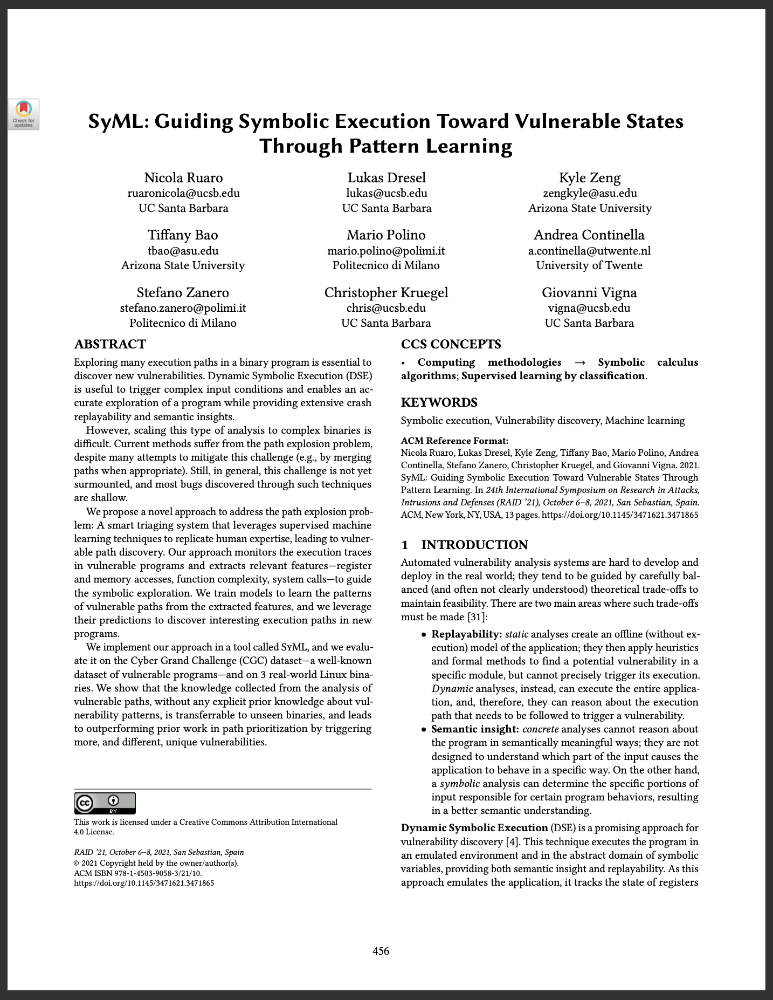

# SyML: Guiding symbolic execution toward vulnerable states through pattern learning


[](https://www.python.org)

<a href="https://seclab.cs.ucsb.edu/files/publications/ruaro21syml.pdf">  </a>

This repository contains the code used for our RAID 2021 paper <a href="https://seclab.cs.ucsb.edu/files/publications/ruaro21syml.pdf">SyML: Guiding symbolic execution toward vulnerable states through pattern learning</a>.

### Dataset
This repo is a good source for the CGC binaries: https://github.com/zardus/cgc-bins
A list of (benign and crashing) inputs for the CGC binaries is available here: https://github.com/ruaronicola/cgc-inputs

### Usage
Given a set of binaries and crashing inputs, to prepare the model for exploration: 
```bash
# analyze each binary+pov
run.py --analyse --filename CADET_00001 --pov CADET_00001.pov
# ...
# concatenate the resulting traces
run.py --concatenate
# train while excluding the target binary
run.py --train --filename CADET_00001
# load the model model.XGBClassifier.CADET_00001.pkl generated in the previous step and explore the target binary
run.py --explore ml
```

### Known Issues
Some of the depencies of this project (for example, [archr](https://github.com/angr/archr)) have since been updated and are now incompatible, it might be necessary to check out an older version.